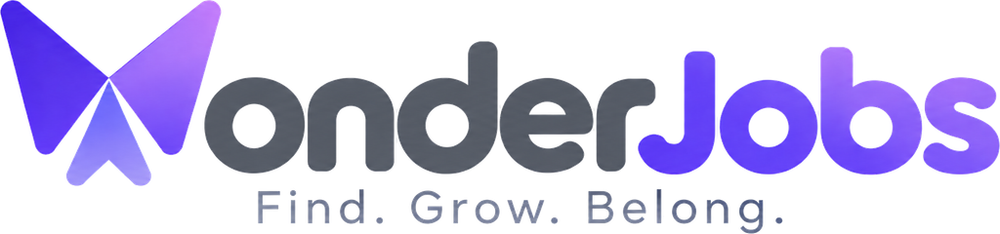

# WonderJobs



Your next opportunity is out there. Wonder finds it.

Monorepo (npm workspaces). The web app lives in `apps/web` (Next.js 16, App Router, TypeScript, Tailwind v4).

## Develop

```bash
npm install
npm run dev        # http://localhost:3000
npm run check      # lint + typecheck + tests + production build
npm run a11y       # axe-core accessibility audit against a production build (needs Chromium: `npx playwright install chromium`, or set PW_CHROMIUM_PATH)
```

## Configuration

Copy `apps/web/.env.example` to `apps/web/.env.local` (and set the same variables in Vercel):

| Variable | Purpose |
|---|---|
| `NEXT_PUBLIC_SUPABASE_URL` | Supabase project URL (`SUPABASE_URL` also accepted). |
| `NEXT_PUBLIC_SUPABASE_PUBLISHABLE_KEY` | Publishable key. Used by the browser for Supabase Auth (sign-in, sign-up, magic links) and by the server/proxy to verify session tokens. Data access itself stays service-role and server-side. |
| `SUPABASE_SERVICE_ROLE_KEY` | Service role key. Server-side only — never exposed to the browser. RLS is on with no anon policies. |
| `SECRET_ENCRYPTION_KEY` | 32+ char key that encrypts BYOK provider secrets at rest (AES-256-GCM). Required in production (`WONDER_SECRET_KEY` also accepted). |
| `WONDERJOBS_AI_KEY` / `WONDERJOBS_AI_MODEL` | Optional. Anthropic key (and model, default `claude-sonnet-5`) that powers "WonderJobs AI" drafting for every account on the platform's bill. Without it, drafts are deterministic templates and the AI settings page says so; users can still connect their own key. |
| `ADZUNA_APP_ID` / `ADZUNA_APP_KEY` | Optional. Enables the Adzuna India job source (free developer tier). |

Without the Supabase variables the app runs in local-only mode (no sign-in, the seeded demo candidate, browser localStorage + in-memory server state). With them, visitors sign in with Supabase Auth, every store syncs per user to `wonderjobs.app_state`, provider keys go to `wonderjobs.ai_provider_secrets` (ciphertext only) and external actions are audited in `wonderjobs.action_audit`. All tables live in the dedicated `wonderjobs` schema. Schema source: `apps/web/supabase/migrations/`.

## Job sources (real data)

Runs search live public sources through `GET /api/jobs/search` (one request per source, server-side, cached 15 minutes): **company career sites** (public Greenhouse, Lever and Ashby boards listed in `apps/web/src/server/jobs/providers.ts`; applications go straight to the employer), **Remotive**, **Jobicy**, **Remote OK**, **Himalayas**, **Arbeitnow** (Europe, off by default) and **Adzuna India** (needs keys). Every posting is normalized by `services/jobs/normalize.ts`: skills, seniority, industry, work mode and salary are derived from the posting's own text with deterministic rules, then scored against the account's Career DNA. Wonder never submits an application on an employer's site; the apply stage hands off with materials ready and the tracker records the submission when the candidate marks it. The demo keeps the generated sample universe.

## Accounts, sessions and the demo

- **Sign-in** (`/sign-in`, `/sign-up`): email + password, a magic link, or Google, through Supabase Auth. Password fields have a reveal toggle. **Forgot password** (`/forgot-password`) emails a single-use recovery link that lands on `/reset-password` via `/auth/callback?token_hash=…&type=recovery`. Sessions live in cookies (`wj-auth`, chunked) so the route proxy and API routes can verify them; the proxy (`apps/web/src/proxy.ts`) guards `/app/*` and `/onboarding`, refreshes expired sessions and mirrors the verified user id into `wj_user` for client-side state namespacing. API routes answer `401` without a session.
- **Per-user state**: a new account starts empty (no invented history), goes through onboarding to create its Career DNA, and everything it does syncs to its own tenant (`tenant_id` = Supabase user id). Local copies are namespaced per user, so a shared device never mixes accounts; sign-out revokes the refresh token, clears cookies and drops that user's local copy.
- **Demo** (`/demo`, also under the avatar menu): the sample candidate "Alex Morgan" with realistic history. Runs entirely on this device (`demo:` localStorage namespace, no server sync, no account). `/demo/exit` leaves it.
- **Supabase Auth settings to check** in the dashboard (Authentication → URL configuration): set *Site URL* to the deployment origin and add `<origin>/auth/callback` to *Redirect URLs*, otherwise confirmation, magic-link and password-reset emails point at `localhost`. "Confirm email" is on by default; the built-in SMTP only delivers to project members and is rate-limited (~2 mails/hour), so connect an SMTP provider (Authentication → SMTP settings) before real sign-ups, or turn confirmation off for password sign-ups.
- **Google sign-in** (`components/auth/GoogleButton.tsx`) needs one-time setup:
  1. Google Cloud Console → APIs & Services → Credentials → *Create credentials → OAuth client ID* (type **Web application**). Authorized JavaScript origin: your deployment origin. Authorized redirect URI: `https://<project-ref>.supabase.co/auth/v1/callback`. Configure the OAuth consent screen (app name, support email) and publish it.
  2. Supabase → Authentication → Providers → **Google**: enable, paste the Client ID and Client secret, save.
  3. Supabase → Authentication → URL configuration: Site URL = deployment origin; Redirect URLs include `<origin>/auth/callback`.
  Until step 2 is done the button shows "Google sign-in isn't switched on for this deployment yet".

## Scheduled runs

Schedules fire on the server, so a run happens at its time whether or not anyone has the app open.

- **Endpoint**: `GET /api/cron/scheduled-runs`, invoked by Vercel Cron (`vercel.json`). Each tick asks the database which tenants have a schedule due (`wonderjobs.due_schedule_tenants`, migration `0004`) and fires at most one schedule per tenant.
- **Setup**: add a `CRON_SECRET` environment variable in Vercel → Settings → Environment Variables (any long random string). Vercel sends it as `Authorization: Bearer …` on scheduled invocations. Without it the endpoint refuses to run — it will not stand open. To test by hand: `curl -H "Authorization: Bearer $CRON_SECRET" https://<origin>/api/cron/scheduled-runs`.
- **Cadence, and the Vercel plan.** Vercel's Hobby plan invokes a cron **once a day**, so `vercel.json` ships `0 2 * * *` (a build with a more frequent schedule is rejected on Hobby). A daily cron is a safety net, not a scheduler: it cannot fire an 08:00 schedule at 08:00. So the browser keeps firing schedules at their proper time while a tab is open, and the two never double-fire — a schedule that already ran in the last 12 hours is skipped by both (`domain/workflow/schedule.ts`, and the same rule in the SQL).
  On **Pro**, change the schedule to `*/15 * * * *` and set `CRON_INTERVAL_MINUTES=15`. Any value at or below 60 tells the app the cron is punctual enough to own scheduling outright, and the browser stands down entirely. The default when the variable is unset is 1440 (daily).
- **What a scheduled run does**: the stages that need nobody present — read the Career DNA, search the enabled sources, deduplicate, analyse, match, check quality, rank — then publishes the catalog, saves strong matches if the automation policy allows, and notifies (or stays silent when the schedule's condition is not met). Preparing materials, reviewing them and handing off to an employer always wait for the candidate; a schedule made only of those stages is skipped rather than half-run.
- **Times are the candidate's own**: a schedule stores the timezone it was created in and fires at that wall-clock time, across daylight-saving changes.
- **The same invocation also raises reminders**: follow-ups and interviews coming due (or a day overdue) become notifications, and a push if the candidate turned them on. Migration `0006` is what lets the cron ask the database who needs one.

## Push notifications

A scheduled run that finds strong matches can nudge the candidate's phone or desktop, not just leave a
line in the app.

- **Setup**: run `npm run push:keys` once (from `apps/web`) and add the three variables it prints —
  `VAPID_PUBLIC_KEY`, `VAPID_PRIVATE_KEY`, `VAPID_SUBJECT` (a `mailto:` the push service can reach you
  at, which RFC 8292 requires). Apply migration `0005` for the `wonderjobs.push_subscriptions` table.
  Without the keys the feature simply doesn't appear — no broken toggle, no empty promise.
- **Turning it on**: Profile → "Notifications on this device". Permission is only ever requested when
  the candidate presses the button, and the server sends one real notification immediately so they can
  see it worked. It is per browser, so each device is turned on separately.
- **Rotating the keys invalidates every existing subscription** — browsers tie a subscription to the
  public key it was created with — so candidates would have to turn notifications on again.
- **iOS**: Safari only allows web push for a site added to the Home Screen. The app says so rather than
  showing a button that cannot work.
- No dependency does the encryption: `server/push/webPush.ts` implements RFC 8291 and RFC 8292 on
  `node:crypto`, and the unit tests check it against RFC 8291's own published test vector.

## Help center and contact

- `/help` is public: user guide, FAQ and an assistant that answers from the guide and links the matching section (`POST /api/help/ask`; uses the platform model when `WONDERJOBS_AI_KEY` is set). Linked as **Get Help** in the avatar menu.
- The landing page ends with **Contact us**; messages are always stored in `wonderjobs.contact_messages` (migration `0003`) with the signed-in tenant when there is one, and you can always read them in Supabase → Table Editor. To also get an email copy, set `CONTACT_NOTIFY_EMAILS` (comma-separated recipients) and `RESEND_API_KEY` (a free [Resend](https://resend.com) key); without the key, notifications are logged server-side instead of emailed. Public company pages: `/about`, `/privacy`, `/terms`, `/security`, `/cookies`.

## Brand assets

`apps/web/public/brand/` holds the logo in the forms the app uses: the full lockup with the tagline, the
logo without it (navigation), and the butterfly mark on its own. Each comes in a **light** and a **dark**
variant — the wordmark's neutral grey is invisible on the product's dark surfaces, so `tone="dark"` swaps
in light ink while keeping the brand purples. `components/brand/WonderLogo.tsx` exposes `WonderMark`,
`WonderLogo` and `WonderLockup`; the favicon and PWA icons are generated from the mark at request time.
If the source artwork changes, drop it in and re-run:

```bash
node apps/web/scripts/brand-assets.mjs apps/web/scripts/brand-source.png
```

## Installing as an app

WonderJobs is an installable PWA (`app/manifest.ts`, generated icons, `public/sw.js`). On Chrome/Edge/Android, "Install app" appears in the avatar menu once the browser decides the page qualifies; there's no such API on iOS Safari or Firefox, so people there use the browser's own "Add to Home Screen". The service worker deliberately caches nothing — this app is local-first and syncs real state already (`store/remoteStorage.ts`), so a caching layer on top would risk showing stale jobs or applications — it only shows a small offline page if a navigation's request fails outright.

## Database schema

Apply the schema once per Supabase project, either:

- **SQL Editor** — paste each file in `apps/web/supabase/migrations/` (in order) into Supabase → SQL Editor and run it, or
- **CLI** — `DATABASE_URL="postgresql://…" npm run db:migrate` (idempotent; records applied files in `public._wonderjobs_migrations`), or
- **From the deployment** — `POST /api/admin/migrate` with `Authorization: Bearer <SUPABASE_SERVICE_ROLE_KEY>` and body `{ "databaseUrl": "postgresql://…" }`. Runs only the bundled migrations; useful when your machine can't reach Postgres directly (Supabase's direct host is IPv6-only — the route falls back to the IPv4 pooler automatically).

## Docs

- `docs/PROGRESS.md` — high-level progress tracker: every epic and story, done or not, updated after each story.
- `docs/IMPLEMENTATION_TRACKER.md` — requirement-by-requirement status and deviations.
